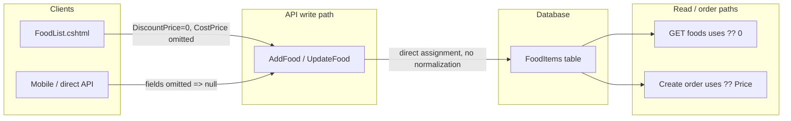
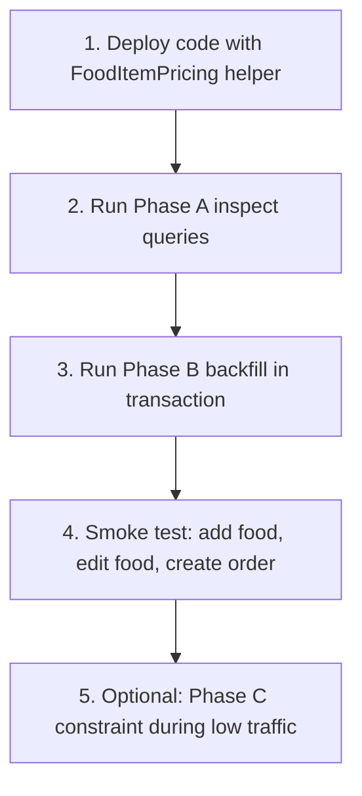

# Fix DiscountPrice and CostPrice NULL Problem

## Root Cause

The problem is not one bug — it is a **write/read mismatch** across three layers:



| Field | What happens today | Result in DB |
|-------|-------------------|--------------|
| `DiscountPrice` | Assigned directly from request in [`Controllers/Api/V2/UserApiController.cs`](Controllers/Api/V2/UserApiController.cs) (lines 720, 823) and [`Controllers/Api/UserApiController.cs`](Controllers/Api/UserApiController.cs) (lines 1136, 1363) | `NULL` when client omits it; `0` when web UI sends empty discount |
| `CostPrice` | Same direct assignment; **never sent** from [`Views/Home/FoodList.cshtml`](Views/Home/FoodList.cshtml) | Always `NULL` from web UI; wiped on every update |

Read endpoints mask the issue with `?? 0` (e.g. V2 lines 2263–2264), so the UI looks fine while the database stores `NULL`.

There is also a **related order bug**: web UI stores `DiscountPrice = 0`, but order creation uses:

```1120:1121:Controllers/Api/V2/UserApiController.cs
UnitPrice = food.Price,
UnitPriceWithDiscount = food.DiscountPrice ?? food.Price,
```

Because `0` is not `null`, orders can get a **0 selling price** when no discount exists. V1 update-order is worse — it casts without fallback:

```1717:1718:Controllers/Api/UserApiController.cs
UnitPrice = food.Price,
UnitPriceWithDiscount = (decimal)food.DiscountPrice,
```

---

## Recommended Business Rules

Centralize pricing rules in one helper (new file: [`Helpers/FoodItemPricing.cs`](Helpers/FoodItemPricing.cs)):

| Field | Rule |
|-------|------|
| `DiscountPrice` | Store the **discounted selling price** only when it is `> 0` and `< Price`; otherwise store `null` (no discount) |
| `CostPrice` | Always store a number; default to **`0`** when omitted |
| Effective selling price | `DiscountPrice ?? Price` (used in orders and UI) |

This matches existing UI logic in [`Views/Home/FoodList.cshtml`](Views/Home/FoodList.cshtml) line 56: `DiscountPrice > 0 && DiscountPrice != Price`.

---

## Implementation Plan

### 1. Add a single pricing helper

Create [`Helpers/FoodItemPricing.cs`](Helpers/FoodItemPricing.cs):

```csharp
public static class FoodItemPricing
{
    public static decimal? NormalizeDiscountPrice(decimal price, decimal? discountPrice)
        => discountPrice is > 0 and var d && d < price ? d : null;

    public static decimal NormalizeCostPrice(decimal? costPrice)
        => costPrice ?? 0;

    public static decimal GetEffectiveSellingPrice(decimal price, decimal? discountPrice)
        => NormalizeDiscountPrice(price, discountPrice) ?? price;
}
```

All write and order logic should call this helper — no duplicated `??` expressions.

### 2. Normalize on write in both API versions

Update **4 endpoints** to use the helper instead of direct assignment:

- V2: `AddFood`, `UpdateFood` in [`Controllers/Api/V2/UserApiController.cs`](Controllers/Api/V2/UserApiController.cs)
- V1: `AddFood`, `UpdateFood` in [`Controllers/Api/UserApiController.cs`](Controllers/Api/UserApiController.cs)

Replace:

```csharp
DiscountPrice = request.DiscountPrice,
CostPrice = request.CostPrice,
```

With:

```csharp
DiscountPrice = FoodItemPricing.NormalizeDiscountPrice(request.Price, request.DiscountPrice),
CostPrice = FoodItemPricing.NormalizeCostPrice(request.CostPrice),
```

This fixes:
- API/mobile clients that omit fields
- Web UI updates that wipe `CostPrice`
- Inconsistent `0` vs `NULL` for no-discount items

### 3. Fix order creation/update to use effective price

Replace fragile `??` / cast logic in order item creation:

| Location | Current | Fix |
|----------|---------|-----|
| V2 create order (~line 1121) | `food.DiscountPrice ?? food.Price` | `FoodItemPricing.GetEffectiveSellingPrice(food.Price, food.DiscountPrice)` |
| V1 create order (~line 1540) | same | same |
| V1 update order (~line 1718) | `(decimal)food.DiscountPrice` | same |

This prevents free orders when `DiscountPrice = 0`.

### 4. Update entity model (no EF migration)

Per your choice: **default CostPrice to 0, no UI field**.

- Change [`Models/FoodItem.cs`](Models/FoodItem.cs): `public decimal CostPrice { get; set; } = 0;` (non-nullable)
- Keep `DiscountPrice` as `decimal?` — `null` correctly means “no discount”
- **Do not add an EF migration** — run the manual SQL below on production instead, then update [`Migrations/AppDbContextModelSnapshot.cs`](Migrations/AppDbContextModelSnapshot.cs) only if you later want EF schema in sync (optional)

### 5. Manual SQL for production (instead of migration)

Database: **SQL Server**. Table names: `FoodItems`, `OrderItems`.

#### Phase A — Inspect only (run first, zero risk)

```sql
-- How many rows are affected?
SELECT
    COUNT(*) AS TotalFoodItems,
    SUM(CASE WHEN CostPrice IS NULL THEN 1 ELSE 0 END) AS NullCostPrice,
    SUM(CASE WHEN DiscountPrice IS NULL THEN 1 ELSE 0 END) AS NullDiscountPrice,
    SUM(CASE WHEN DiscountPrice = 0 THEN 1 ELSE 0 END) AS ZeroDiscountPrice,
    SUM(CASE WHEN DiscountPrice IS NOT NULL AND DiscountPrice >= Price THEN 1 ELSE 0 END) AS InvalidDiscountPrice
FROM FoodItems;

-- Preview rows that will change (CostPrice)
SELECT FoodItemId, Name, Price, DiscountPrice, CostPrice
FROM FoodItems
WHERE CostPrice IS NULL;

-- Preview rows that will change (DiscountPrice normalization)
SELECT FoodItemId, Name, Price, DiscountPrice, CostPrice
FROM FoodItems
WHERE DiscountPrice IS NOT NULL AND (DiscountPrice <= 0 OR DiscountPrice >= Price);

-- Check for orders charged at 0 (important!)
SELECT oi.OrderItemId, oi.OrderId, oi.FoodItemId, oi.UnitPrice, oi.UnitPriceWithDiscount, oi.Quantity
FROM OrderItems oi
WHERE oi.UnitPriceWithDiscount = 0;
```

#### Phase B — Backfill data (safe for live users)

Run during low traffic. These updates **do not change what users see today** — reads already treat NULL/0 as “no discount” and NULL cost as 0.

```sql
BEGIN TRANSACTION;

-- 1) CostPrice: NULL -> 0
UPDATE FoodItems
SET CostPrice = 0
WHERE CostPrice IS NULL;

-- 2) DiscountPrice: invalid/zero -> NULL (means no discount)
UPDATE FoodItems
SET DiscountPrice = NULL
WHERE DiscountPrice IS NOT NULL
  AND (DiscountPrice <= 0 OR DiscountPrice >= Price);

-- 3) Optional: fix past orders that were stored with 0 price
--    ONLY run if Phase A found rows in OrderItems with UnitPriceWithDiscount = 0
UPDATE oi
SET oi.UnitPriceWithDiscount = oi.UnitPrice
FROM OrderItems oi
WHERE oi.UnitPriceWithDiscount = 0
  AND oi.UnitPrice > 0;

COMMIT TRANSACTION;
```

#### Phase C — Optional constraint (defer if you prefer zero DB risk)

Only after Phase B succeeds. Adds a brief schema lock on `FoodItems` while altering the column.

```sql
-- Add default first (online-friendly on SQL Server)
ALTER TABLE FoodItems
ADD CONSTRAINT DF_FoodItems_CostPrice DEFAULT (0) FOR CostPrice;

-- Then enforce NOT NULL (requires all NULLs already fixed in Phase B)
ALTER TABLE FoodItems
ALTER COLUMN CostPrice decimal(18,2) NOT NULL;
```

**Rollback (if needed before Phase C):**

```sql
-- Revert CostPrice constraint only
ALTER TABLE FoodItems DROP CONSTRAINT DF_FoodItems_CostPrice;
ALTER TABLE FoodItems ALTER COLUMN CostPrice decimal(18,2) NULL;
```

Phase C is **optional**. The code helper alone prevents new NULL `CostPrice` values even without the DB constraint.

### 6. Keep read endpoints as-is (minor cleanup optional)

Existing `DiscountPrice = f.DiscountPrice ?? 0` in [`Controllers/HomeController.cs`](Controllers/HomeController.cs), [`Controllers/MenuController.cs`](Controllers/MenuController.cs), and API GET handlers can stay — they already match UI expectations. No UI changes required in [`Views/Home/FoodList.cshtml`](Views/Home/FoodList.cshtml) since server-side normalization handles both `0` and omitted values.

---

## Files to Change

| File | Change |
|------|--------|
| [`Helpers/FoodItemPricing.cs`](Helpers/FoodItemPricing.cs) | **New** — shared normalization |
| [`Models/FoodItem.cs`](Models/FoodItem.cs) | `CostPrice` non-nullable, default 0 |
| [`Controllers/Api/V2/UserApiController.cs`](Controllers/Api/V2/UserApiController.cs) | Normalize on add/update; fix create order |
| [`Controllers/Api/UserApiController.cs`](Controllers/Api/UserApiController.cs) | Normalize on add/update; fix create + update order |
| Production SQL Server | Manual scripts (Phase A → B → optional C) — **no EF migration** |

---

## Is This Safe for a Live Service?

**Yes — if you deploy in the right order.** This fix is low-risk because it aligns stored data with behavior your app **already assumes** on read.

### What is safe

| Change | Risk | Why |
|--------|------|-----|
| Deploy code helper first | **Very low** | Stops new NULLs immediately; fixes order pricing bug. No DB change needed. Zero downtime. |
| Backfill `CostPrice NULL → 0` | **Very low** | UI/API already return `CostPrice ?? 0`. Users see no difference. |
| Normalize `DiscountPrice 0 → NULL` | **Low** | UI already treats 0 and NULL as “no discount”. Menu display unchanged. |
| Fix `OrderItems` with price 0 | **Low–medium** | Only affects **historical** order totals/reports, not live menu. Run inspect query first; skip if count is 0. |

### What to watch

| Change | Risk | Mitigation |
|--------|------|------------|
| `ALTER COLUMN CostPrice NOT NULL` | **Low** | Brief table lock. Defer Phase C; code normalization is enough. |
| OrderItems backfill | **Medium** | Only run if Phase A finds `UnitPriceWithDiscount = 0`. Back up or export those rows first. |
| Deploy code + SQL at same time | **Low** | Prefer **code first**, then SQL backfill within minutes. Old code + new data still works; new code + old data also works. |

### Recommended live rollout order



1. **Deploy application code first** — this is the most important step and protects live users immediately.
2. **Run inspect queries** — know exactly how many rows change before touching data.
3. **Run backfill in a transaction** — `COMMIT` only after row counts look correct.
4. **Smoke test** on production: add food without discount, create an order, confirm price is correct.
5. **Skip Phase C** unless you want a hard DB guarantee; it is not required for the fix to work.

### What users will notice

- **Nothing changes** on menus or food lists (already masked by `?? 0`).
- **New orders** for no-discount foods will store the correct price instead of 0 (fixes a real bug).
- **Editing food** will no longer wipe `CostPrice` to NULL.

### Before you run SQL on production

- Take a **backup** or ensure point-in-time restore is available.
- Run Phase A on a **read replica** or staging DB first if you have one.
- Run Phase B during **low-traffic hours**.
- Keep Phase C for a maintenance window or skip it entirely.

---

## Verification Checklist

1. **Add food without discount (web UI)** → DB: `DiscountPrice = NULL`, `CostPrice = 0`
2. **Add food with discount** → DB: `DiscountPrice = valid value < Price`, `CostPrice = 0`
3. **Update food without changing discount** → `CostPrice` stays `0`, not `NULL`
4. **Create order for no-discount food** → `UnitPriceWithDiscount = Price` (not 0)
5. **API client omitting both fields** → same normalized result as web UI
6. **Run Phase A/B SQL on production** → no remaining `NULL` in `CostPrice`; invalid discount rows cleaned
7. **Re-run Phase A inspect** → `NullCostPrice = 0`, `ZeroDiscountPrice = 0`

---

## Why This Is a Complete Fix

- **Single source of truth** for pricing rules (helper)
- **Defense in depth**: normalization on write + optional DB constraint on `CostPrice`
- **Fixes hidden order bug** where `0` discount price could charge nothing
- **Repairs existing data** via manual SQL (no EF migration required)
- **Live-safe rollout**: code deploy first, data backfill second, constraint optional
- **No UI changes needed** for CostPrice (defaults to 0 as you requested)
