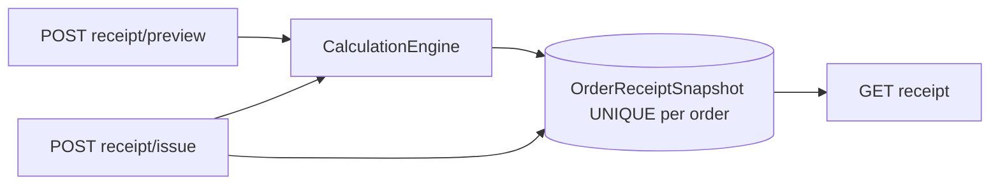
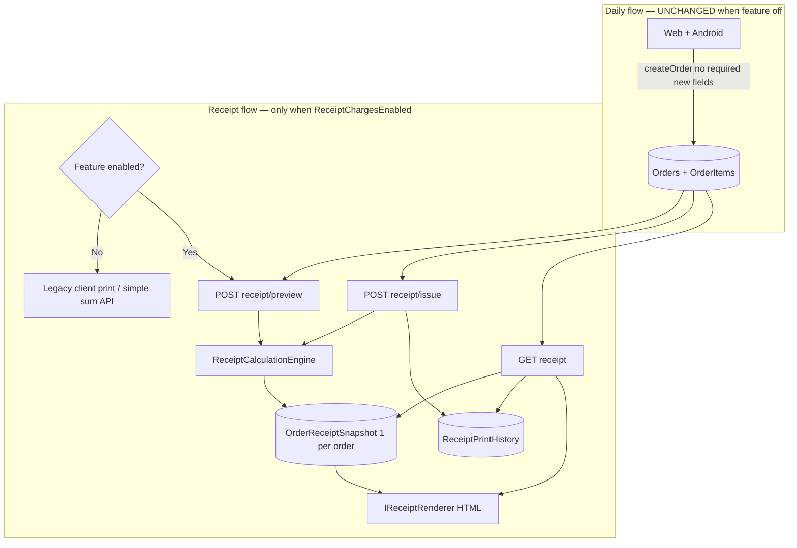

# Receipt Charge System — Final Architecture (Production-Safe)

## Guiding principle

**Nothing changes for any restaurant until `ReceiptChargesEnabled = 1` is set in admin.**

All new tables, columns, and endpoints are inert until then. Daily Web and Android order flows are untouched.

---

## Architectural review of your concerns

### Concern 1: Recalculating on every print

**You are correct — recalculating on every reprint is unsafe.**

If VAT changes from 10% to 12%, the same order must not produce a different official receipt. Financial receipts must be **immutable once issued**.

**Recommended design (adopted):**

| Action | Behavior |
|--------|----------|
| **Preview** (before first issue) | Calculate live from current charge defs + user selections — read-only, not saved |
| **Issue** (first official print) | Calculate once → persist **immutable snapshot** → render receipt |
| **Reprint** (any later print) | Load snapshot only — **no recalculation**, immune to rate changes |



**Trade-offs:**

| Approach | Pros | Cons |
|----------|------|------|
| Recalculate every print | Always uses latest rates | **Wrong for finance** — inconsistent receipts |
| Immutable snapshot on first issue | Correct, auditable, stable reprints | Order items edited after issue won't auto-update receipt (correct for invoices) |
| Snapshot on order create | Earliest freeze | Breaks receipt-only scope; touches daily flow |

**Safest choice:** immutable snapshot on **first issue**, not on every print, not on order create.

**Edge case — items edited after receipt issued:** reprint still shows the issued snapshot (correct). Issuing a second receipt for the same order is blocked in v1 (`UNIQUE OrderId` on snapshot). Future "void & reissue" would be an explicit admin workflow, not silent recalculation.

---

### Concern 2: One snapshot vs multiple snapshots

**You are correct — one immutable financial snapshot per order is cleaner.**

| Design | Use |
|--------|-----|
| **`OrderReceiptSnapshots`** (1 row per order, `UNIQUE(OrderId)`) | Financial truth: charges, totals, order type, full `ReceiptPayloadJson` |
| **`ReceiptPrintHistory`** (many rows per order) | Operational audit: who printed, when, channel (Web/Android), IP optional |

Multiple snapshot rows per order conflates "financial record" with "print event" and makes history/Excel ambiguous (which total is correct?).

**`ReceiptPrintHistory` schema (lightweight):**

```text
Id, OrderId, OrderReceiptSnapshotId (FK), PrintedAt, PrintedByUserId, Channel
```

Every print (including reprints) appends a history row. Only the **first issue** creates the snapshot.

---

### Concern 3: Order type at print time vs on order

**Choosing order type only at print time is risky.** Delivery fee can disappear if someone picks Dine-In by mistake.

**Recommended hybrid (adopted):**

1. Add **`Orders.OrderType`** `TINYINT NOT NULL DEFAULT 0` (DineIn) — **backward compatible**, no client change required.
2. Android/Web that don't send `OrderType` → always DineIn (today's implicit behavior).
3. Web can optionally set `OrderType` on create/edit when ready — **optional field**, not required.
4. Print modal **pre-fills** from `Order.OrderType`.
5. Staff may change `OrderType` in the modal **only before first issue** (preview phase).
6. On **issue**, `OrderType` is frozen into the snapshot; reprints use snapshot value.
7. Optionally write confirmed `OrderType` back to `Orders` on issue (keeps order record aligned).

**Why not require OrderType at create from day one?** That would force Android app changes. Default `DineIn` preserves current behavior for all live clients.

**Future:** when Android adds order-type picker, it sends optional `orderType` on `createOrder` — no API break.

---

### Concern 4: Future evolution without over-engineering v1

**Build a thin, extensible core now; defer renderers and integrations.**

| Layer | v1 | Future (same interfaces) |
|-------|-----|--------------------------|
| `RestaurantChargeDefinitions` | Config rows (VAT, service, delivery, custom) | Same — new charges = new rows |
| `ReceiptCalculationEngine` | Category pipeline (Discount→Fee→Tax) | Same engine; optional order-write hook later |
| `ReceiptDto` | Canonical calculated model | PDF, email, WhatsApp all consume it |
| `IReceiptRenderer` | `HtmlReceiptRenderer` only | `PdfReceiptRenderer`, `EscPosReceiptRenderer` |
| `OrderReceiptSnapshot.ReceiptPayloadJson` | Full DTO serialized | New receipt layouts read same JSON |
| Feature flag | Per-restaurant admin toggle | Same |
| Order daily flow | Unchanged | Optional phase 2: engine on create/update |

**What we deliberately skip in v1:** PDF, ESC/POS, email, void/reissue workflow, multi-layout picker, tax-inclusive pricing, item-level tax groups. The snapshot JSON + renderer interface make these additive.

---

## Revised architecture



---

## Data model

### 1. `Restaurants.ReceiptChargesEnabled` — `BIT NOT NULL DEFAULT 0`

Platform admin only. Default off for all restaurants.

### 2. `Orders.OrderType` — `TINYINT NOT NULL DEFAULT 0`

| Value | Meaning |
|-------|---------|
| 0 | DineIn (default — matches all existing orders) |
| 1 | Takeaway |
| 2 | Delivery |

No backfill needed. Existing rows implicitly DineIn.

### 3. `RestaurantChargeDefinitions` — charge templates

Unchanged from prior plan: `Code`, `Title`, `ChargeCategory`, `CalculationType`, `Value`, `IsEnabled`, `IsTaxable`, `PercentageBase`, `DisplayOrder`, `AppliesToOrderTypes`.

### 4. `OrderReceiptSnapshots` — one immutable row per order

| Column | Purpose |
|--------|---------|
| `Id` | PK |
| `OrderId` | FK, **UNIQUE** — one official receipt per order |
| `RestaurantId` | FK |
| `OrderType` | Frozen at issue |
| `ItemsSubtotal` | Frozen |
| `GrandTotal` | Frozen |
| `ChargeLinesJson` | Applied charges with calculated amounts |
| `ReceiptPayloadJson` | Full `ReceiptDto` for renderers and future layouts |
| `OrderItemsVersion` | `Order.UpdatedAt` or hash at issue — detect item drift |
| `IssuedAt` | UTC |
| `IssuedByUserId` | Who confirmed first issue |

### 5. `ReceiptPrintHistory` — audit trail

| Column | Purpose |
|--------|---------|
| `Id` | PK |
| `OrderId` | FK |
| `OrderReceiptSnapshotId` | FK |
| `PrintedAt` | UTC |
| `PrintedByUserId` | Nullable |
| `Channel` | `Web`, `Android`, `Api` |

---

## Calculation engine (unchanged logic, narrower trigger)

Pipeline: ItemsNet → Discounts → Fees → TaxableBase (via `IsTaxable`) → Taxes → GrandTotal.

**Called only when:**
- `POST receipt/preview` (no save)
- `POST receipt/issue` and no snapshot exists yet

**Never called on reprint.**

---

## API design

### Feature gate

```csharp
if (!restaurant.ReceiptChargesEnabled)
    return LegacyReceipt(order); // identical to today
```

### Endpoints (v2 JWT; v1 can mirror later)

| Method | Route | Purpose |
|--------|-------|---------|
| `POST` | `api/v2.0/UserApi/orders/{orderId}/receipt/preview` | Live calculation; modal uses this |
| `POST` | `api/v2.0/UserApi/orders/{orderId}/receipt/issue` | First issue only → creates snapshot → returns JSON |
| `GET` | `api/v2.0/UserApi/orders/{orderId}/receipt` | HTML render; uses snapshot if exists, else legacy |
| `GET` | `api/v2.0/UserApi/orders/{orderId}/receipt-data` | JSON; snapshot if exists |
| `GET/POST` | `api/v2.0/UserApi/restaurants/{id}/charge-definitions` | Template CRUD (gated) |
| `POST` | `Admin/SetReceiptChargesEnabled` | Admin toggle |

### Preview / issue request body

```json
{
  "orderType": 2,
  "charges": [
    { "definitionId": 3, "isEnabled": true, "value": 9 }
  ]
}
```

### Issue rules

1. If snapshot exists → **409 Conflict** `"Receipt already issued for this order"` (reprint via GET only).
2. If no snapshot → calculate, insert snapshot, append print history, return receipt.
3. Optionally update `Orders.OrderType` from confirmed value.

### Reprint rules

1. Load snapshot → deserialize `ReceiptPayloadJson` → render HTML.
2. Append `ReceiptPrintHistory` row (no recalculation).

---

## Production safety checklist

| Guarantee | How |
|-----------|-----|
| Existing restaurants unaffected | `ReceiptChargesEnabled = 0` default; legacy print path preserved |
| Android app unaffected | No required API changes; `OrderType` defaults to DineIn |
| Web daily orders unaffected | createOrder/updateOrder unchanged in v1 |
| No historical data mutation | SQL only adds columns/tables; no backfill |
| Receipt consistency | Immutable snapshot on first issue |
| Rate changes safe | Reprints read snapshot, not live defs |
| Test in isolation | Admin enables one restaurant |
| Database-first deploy | Idempotent SQL script; EF maps afterward |

---

## UI (scoped)

### Admin

- Toggle **Receipt charges** per restaurant on restaurant list.

### Restaurant manager (feature on only)

- Charge definition templates (defaults for preview modal).
- Print button flow:
  1. If snapshot exists → `GET receipt` → print (no modal).
  2. If no snapshot → modal (order type pre-filled from order, charge toggles) → preview → confirm issue → print.
- Feature off → existing [`invoice-print.js`](wwwroot/js/invoice-print.js) unchanged.

### Android

- Phase 1: unchanged.
- Phase 2: enabled restaurants call `GET receipt` (reprint-safe); first issue may need Web until Android UI built.

### History + Excel (additive)

- Item subtotal: unchanged (today's behavior).
- If snapshot exists: add **مبلغ فاکتور** and **تاریخ صدور فاکتور**.
- Excel: optional `ReceiptGrandTotal`, `ReceiptIssuedAt` columns — blank without snapshot.
- Dashboard revenue formulas: **unchanged in v1**.

---

## Database-first SQL (deliverable)

**`Scripts/AddReceiptChargeSystem.sql`** — idempotent, production-safe:

```sql
-- 1) Feature flag on Restaurants (DEFAULT 0)
-- 2) OrderType on Orders (TINYINT NOT NULL DEFAULT 0)
-- 3) CREATE RestaurantChargeDefinitions
-- 4) CREATE OrderReceiptSnapshots (UNIQUE on OrderId)
-- 5) CREATE ReceiptPrintHistory
-- 6) Indexes + FKs
-- NO updates to existing order rows
-- NO enable flags set to 1
```

Optional: **`Scripts/SeedReceiptChargeDefinitions_TestRestaurant.sql`** for manual test data.

EF: add entity classes + `DbSet` + Fluent config in [`Data/AppDbContext.cs`](Data/AppDbContext.cs) **after** SQL is run. No `Database.Migrate()`.

---

## Phased rollout

| Phase | Action | Live user impact |
|-------|--------|------------------|
| 0 | Run SQL on production | None |
| 1 | Deploy code (all paths gated) | None |
| 2 | Admin enable your test restaurant | Yours only |
| 3 | Configure charge defs + test preview/issue/reprint | Yours only |
| 4 | Verify history/Excel columns | Yours only |
| 5 | Enable more restaurants via admin | Opt-in |
| 6 | Android uses receipt URL | Enabled restaurants only |

---

## What v1 explicitly excludes

- Recalculation on reprint
- Multiple financial snapshots per order
- Required `OrderType` on createOrder (optional only, when clients ready)
- Changes to createOrder/updateOrder charge logic
- PDF / ESC/POS / email / WhatsApp (interfaces ready, impl later)
- Void & reissue receipt workflow
- Dashboard revenue switch to receipt totals
- EF migrations for production

---

## Implementation order

1. **`Scripts/AddReceiptChargeSystem.sql`** — run manually on production
2. EF models for new schema
3. `ReceiptCalculationEngine` + `ReceiptDto`
4. `ReceiptBuilder` (snapshot-first: load or calculate)
5. `IReceiptRenderer` + `HtmlReceiptRenderer`
6. API: preview / issue / reprint with feature gate + legacy fallback
7. Admin feature toggle
8. Restaurant charge definition CRUD (gated)
9. Web print modal (preview → issue → reprint)
10. History + Excel additive columns
11. Test on your restaurant → enable others

---

## Why this is the right balance

- **Production safety:** feature flag + no daily-flow changes + default OrderType = DineIn.
- **Backward compatibility:** every existing client keeps working; new behavior is opt-in per restaurant.
- **Financial correctness:** immutable first-issue snapshot solves the VAT-change problem.
- **Operational simplicity:** one snapshot = one truth; print history = lightweight audit.
- **Future extensibility:** `ReceiptDto` + `IReceiptRenderer` + charge definition rows support PDF, thermal, and reporting without redesign.
- **Maintainability:** single calculation engine, single snapshot store, clear preview vs issue vs reprint API contract.
