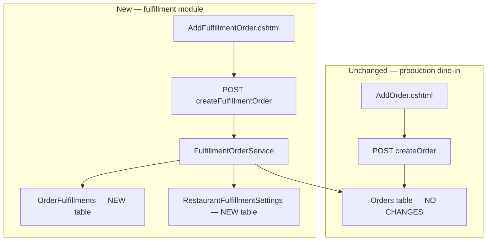
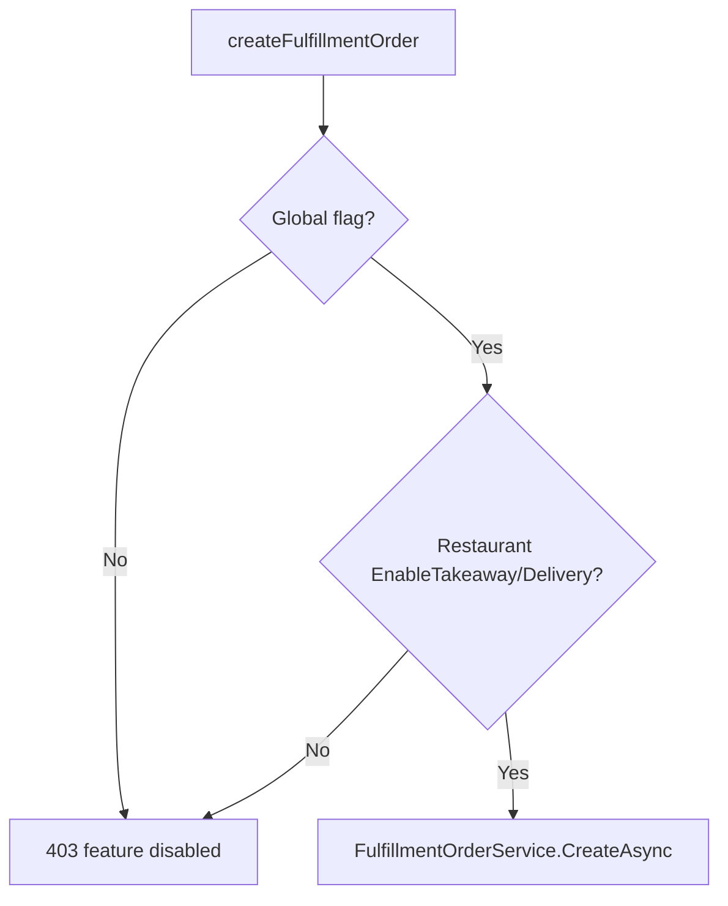

# Takeaway / Delivery Orders — Cleaner Architecture (Revised)

## What changed in this revision

Your priority: **the database must not change in a way that causes problems for existing users.**

The revised plan achieves that by:

1. **Not modifying the `Orders` table at all** — no new columns, no nullable changes, no defaults to backfill.
2. **Storing all takeaway/delivery data in a new side table** — only new orders of those types get a row.
3. **Leaving `createOrder` completely untouched** — dine-in uses the exact same endpoint and code path as today.
4. **Adding a separate `createFulfillmentOrder` endpoint** — new feature, new code, easy to disable or delete without touching production dine-in logic.

This is cleaner to develop later because fulfillment becomes its own bounded module: model, service, API, UI, settings — all isolated from core orders.

---

## Executive recommendation



**Rule of thumb:** If a row does not exist in `OrderFulfillments`, the order is dine-in — exactly as today. Zero ambiguity for existing data.

---

## Database design — two new tables only

### Table 1: `OrderFulfillments` (1:1 with Order, optional)

| Column | Type | Notes |
|--------|------|-------|
| `OrderId` | `int PK/FK` | References `Orders.OrderId`, cascade delete |
| `FulfillmentType` | `tinyint` | `1=Takeaway`, `2=Delivery` (no row = dine-in) |
| `CustomerAddressId` | `int NULL` | FK to `CustomerAddresses`, optional |
| `AddressSnapshot` | `nvarchar(1000)` | Frozen address at order time |
| `PhoneSnapshot` | `nvarchar(20) NULL` | Phone at order time |
| `CreatedAt` | `datetime2` | Audit |

**Why this is safest for existing users:**
- Every existing order in production has **no row** here — nothing to migrate, nothing to default, nothing to backfill.
- All existing SQL, EF queries, Excel exports, and mobile list endpoints that read `Orders` alone continue to work identically.
- New fulfillment fields (delivery fee, driver name, scheduled pickup, GPS) go into this table later — never polluting `Orders`.

### Table 2: `RestaurantFulfillmentSettings` (1:1 with Restaurant)

| Column | Type | Default | Notes |
|--------|------|---------|-------|
| `RestaurantId` | `int PK/FK` | — | References `Restaurants` |
| `EnableTakeaway` | `bit` | `false` | Per-restaurant opt-in |
| `EnableDelivery` | `bit` | `false` | Per-restaurant opt-in |
| `UpdatedAt` | `datetime2` | `GETDATE()` | — |

**Why a separate table instead of columns on `RestaurantSettings`:**
- [`RestaurantSettings`](Models/RestaurantSetting.cs) is already tied to menu theming — mixing operational feature flags there couples unrelated concerns.
- A dedicated settings table is the pattern you can reuse for the next feature (loyalty, reservations, etc.).
- Restaurants with no row = feature disabled (same as today).

> **Your approval needed:** Only these two **new** tables. The `Orders`, `OrderItems`, and `RestaurantSettings` tables are **not modified**.

### `TableNumber` for fulfillment orders

Because `Orders.TableNumber` stays required and unchanged, fulfillment orders will store a fixed sentinel in the service layer only:

- Takeaway → `"بیرون‌بر"`
- Delivery → `"پیک"`

Staff never rely on this string — UI reads `FulfillmentType` from the side table join. Existing dine-in orders keep real table names.

---

## Service layer — easier to extend later

Instead of branching inside `createOrder`, introduce a focused module:

```
Services/
  Fulfillment/
    IFulfillmentOrderFeature.cs      # flag checks (global + restaurant)
    IFulfillmentOrderService.cs
    FulfillmentOrderService.cs       # validate + create Order + OrderFulfillment
    FulfillmentType.cs               # enum: Takeaway=1, Delivery=2
    CreateFulfillmentOrderRequest.cs # dedicated request model
    FulfillmentOrderDto.cs           # response/list projection
```

### `FulfillmentOrderService.CreateAsync()` responsibilities

1. Check global + restaurant feature flags
2. Validate customer/address rules by type
3. Create standard `Order` + `OrderItems` (same item snapshot logic as today)
4. Insert `OrderFulfillment` row in same transaction
5. Create `OrderUpdate` + SignalR (reuse existing helpers)

### Strategy for status labels (UI only, no DB change)

| Side-table type | Status 5 label | Status 6 label |
|---|---|---|
| No row (dine-in) | آماده تحویل | تحویل داده شده |
| Takeaway | آماده تحویل | تحویل به مشتری |
| Delivery | آماده ارسال | ارسال شده |

Reuse existing statuses 3→4→5→6→7→8→11 and `GetNextRoleId` — unchanged.

---

## API design — separate endpoint (safest)

### Keep unchanged

- `POST /api/v2/UserApi/createOrder` — **zero modifications**
- `POST /api/UserApi/createOrder` (V1) — **zero modifications**
- [`CreateOrderRequest`](Models/CreateOrderRequest.cs) — **unchanged**

### Add new (V2 + V1 mirror)

```
POST /api/v2/UserApi/createFulfillmentOrder
POST /api/UserApi/createFulfillmentOrder
```

**Request body** (`CreateFulfillmentOrderRequest`):

```csharp
public class CreateFulfillmentOrderRequest
{
    public int RestaurantId { get; set; }
    public FulfillmentType FulfillmentType { get; set; }  // 1 or 2 only
    public int StatusId { get; set; }                     // default 3
    public List<CreateOrderItemRequest> Items { get; set; }
    public int CustomerId { get; set; }                   // required
    public int? CustomerAddressId { get; set; }           // delivery: required unless AddressText
    public string? AddressText { get; set; }              // delivery: snapshot override
    public string? PhoneSnapshot { get; set; }
    public string? Description { get; set; }
}
```

**Validation (only in new endpoint):**

| Type | Required |
|------|----------|
| Takeaway | `CustomerId`, items |
| Delivery | `CustomerId`, items, address (`CustomerAddressId` or `AddressText`) |

**Response:** same shape as today `{ success, orderId, message }` plus optional `fulfillmentType`.

### Read paths — additive LEFT JOIN

Extend list/detail queries **optionally** with:

```csharp
from o in orders
join f in fulfillments on o.OrderId equals f.OrderId into fj
from f in fj.DefaultIfEmpty()
// f == null → dine-in
```

Apply to:
- `GetOrdersByRestaurant`
- `ManagerOrderList` / cashier queries
- `OrderDto` → add optional `FulfillmentType?` and `AddressSnapshot?`

Old mobile apps that ignore new fields: unaffected.

---

## Feature flags

**Global kill switch** — [`appsettings.json`](appsettings.json):

```json
"Features": {
  "FulfillmentOrders": { "Enabled": false }
}
```

**Per-restaurant** — `RestaurantFulfillmentSettings` row (created on first enable).



Rollback = flip global flag to `false`. Existing `createOrder` never checks this flag.

---

## Web UI

**Do not touch** [`AddOrder.cshtml`](Views/Home/AddOrder.cshtml).

**New page:** `AddFulfillmentOrder.cshtml` + `HomeController.AddFulfillmentOrder()`
- Tabs: بیرون‌بر / پیک
- Customer search + address picker (reuse existing customer APIs)
- Submit to `createFulfillmentOrder` only
- Nav link in [`_Layout.cshtml`](Views/Shared/_Layout.cshtml) visible only when flags + settings allow

**List views** (display-only, phase 1):
- [`_ManagerOrdersPartial.cshtml`](Views/Home/_ManagerOrdersPartial.cshtml) — badge when side-table row exists
- [`_CashierOrdersPartial.cshtml`](Views/Home/_CashierOrdersPartial.cshtml) — same

---

## Phased rollout

### Phase 0 — Dark deploy (zero user impact)
- Migration: create `OrderFulfillments` + `RestaurantFulfillmentSettings` only
- Deploy service + new endpoints with global flag `false`
- Smoke test: all existing dine-in flows unchanged
- **Existing users see nothing new**

### Phase 1 — Pilot (1–2 restaurants)
- Enable global flag + restaurant settings for pilots
- Staff uses `AddFulfillmentOrder`
- Monitor errors + fulfillment row counts

### Phase 2 — GA for opted-in restaurants
- Settings UI for owners to toggle takeaway/delivery
- Update FAQ on [`Index.cshtml`](Views/Home/Index.cshtml)

### Phase 3 — Mobile (optional)
- New optional API call from Android — old app unchanged

### Phase 4 — Public QR menu (later, separate)
- Not in initial scope

---

## Keeping production stable (your #1 constraint)

### Why existing users cannot break

| Risk | Mitigation |
|------|------------|
| Migration alters existing order rows | **No** — new tables only |
| Existing queries fail on new columns | **No** — `Orders` schema identical |
| Mobile app sends wrong payload | Old app uses `createOrder` — untouched |
| New code breaks dine-in | Dine-in never calls new endpoint or service |
| Partial deploy (new DB, old code) | New tables ignored by old code — safe |
| Partial deploy (new code, old DB) | Migration must run first; gate feature off until migrated |

### Before deploy
1. Full DB backup
2. Run migration on staging copy — verify `Orders` row count and schema unchanged
3. Smoke tests on staging: dine-in create, status update, Excel export, mobile list
4. Confirm zero rows in `OrderFulfillments` after migration

### During deploy
1. Run migration (creates empty tables — seconds, no data rewrite)
2. Deploy app with `Features.FulfillmentOrders.Enabled = false`
3. Normal IIS/app pool recycle only

### After deploy
1. Monitor Serilog — especially `createOrder` error rate (should be flat)
2. Confirm no accidental rows in `OrderFulfillments` until pilot
3. Enable one pilot restaurant only

### Rollback playbook

| Problem | Action | User impact |
|---------|--------|-------------|
| New UI bug | Hide nav link | None for others |
| Fulfillment API bug | Global flag off | Pilots lose new feature; dine-in fine |
| Dine-in regression | Revert deploy | None if caught early |
| Migration issue | Restore backup before traffic | Standard DR |

**Never need to roll back migration** — empty side tables are inert. Worst case: drop `OrderFulfillments` and `RestaurantFulfillmentSettings` if feature is abandoned (only if no pilot data to keep).

---

## Files to create / touch

**New (fulfillment module):**
- `Models/Fulfillment/OrderFulfillment.cs`
- `Models/Fulfillment/RestaurantFulfillmentSettings.cs`
- `Models/Fulfillment/FulfillmentType.cs`
- `Models/Fulfillment/CreateFulfillmentOrderRequest.cs`
- `Models/Fulfillment/FulfillmentOrderDto.cs`
- `Services/Fulfillment/IFulfillmentOrderFeature.cs`
- `Services/Fulfillment/FulfillmentOrderFeature.cs`
- `Services/Fulfillment/IFulfillmentOrderService.cs`
- `Services/Fulfillment/FulfillmentOrderService.cs`
- `Migrations/YYYYMMDD_AddFulfillmentTables.cs`
- `Views/Home/AddFulfillmentOrder.cshtml`
- `wwwroot/js/fulfillment-order.js`

**Modify (minimal, additive):**
- [`Data/AppDbContext.cs`](Data/AppDbContext.cs) — register new DbSets + relationships
- [`Controllers/Api/V2/UserApiController.cs`](Controllers/Api/V2/UserApiController.cs) — add `createFulfillmentOrder` action only
- [`Controllers/Api/UserApiController.cs`](Controllers/Api/UserApiController.cs) — add V1 mirror
- [`Controllers/HomeController.cs`](Controllers/HomeController.cs) — new GET page + settings endpoints
- Order list partials — display badge via optional join
- [`appsettings.json`](appsettings.json) — feature flag section
- `Program.cs` — register services

**Explicitly do NOT modify:**
- [`Models/Order.cs`](Models/Order.cs)
- [`CreateOrderRequest.cs`](Models/CreateOrderRequest.cs)
- [`AddOrder.cshtml`](Views/Home/AddOrder.cshtml)
- Existing `createOrder` method bodies
- Status IDs / `GetNextRoleId`
- [`RestaurantSetting.cs`](Models/RestaurantSetting.cs) (menu theming stays separate)

---

## Comparison: original plan vs revised

| Aspect | Original (columns on Orders) | Revised (side tables) |
|--------|------------------------------|------------------------|
| Existing order rows | Unchanged but table schema changes | **Orders table literally unchanged** |
| Existing queries | Still work; new columns ignored | **Identical — no new columns** |
| API risk | Branch inside `createOrder` | **Separate endpoint — zero touch** |
| Future fields (driver, fee) | More columns on Orders | Add to `OrderFulfillments` |
| Dev complexity | One big conditional service | **Isolated fulfillment module** |
| Rollback | Flag off | Flag off + can delete module |

---

## Success criteria

- Migration adds only two new tables; `Orders` schema byte-for-byte identical for existing columns
- All production dine-in orders work with zero behavior change
- Pilot can create takeaway/delivery; side-table row exists; kitchen/cashier flow works
- Global flag off = feature completely invisible
- Future developer can extend fulfillment without opening core order code

## Out of scope (unchanged)

- Delivery driver assignment / GPS
- Delivery fee
- Online payment for delivery
- Public QR self-order
- New order statuses
- Modifying `Orders` or `OrderItems` tables
