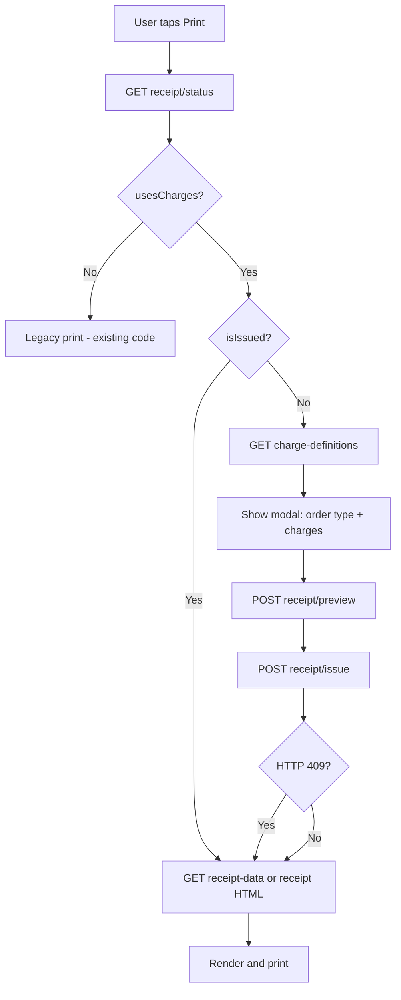

# Android Integration Guide — Receipt Charge System

This document describes how to integrate the **Receipt Charge System** into the Resturanyar Android app. All endpoints live on the existing **V2 API** and use the same JWT authentication the app already uses.

## 1. Overview

This feature adds **configurable charges** (service fee, VAT, packaging, delivery, etc.) to receipts.

| Rule | Detail |
|------|--------|
| Feature flag | Per restaurant, set by admin (`ReceiptChargesEnabled`). Off by default. |
| Order creation | **No changes** to `createOrder` or existing order flows. |
| Auto-issue on settlement | When status becomes **8 (پرداخت شده)** or **11 (بسته شده)**, server auto-issues with restaurant default charges for the order’s `OrderType` (no print required). Skip if snapshot already exists or feature is off. |
| When active | Print is optional after lock. Early manual Issue+print still works. |
| First lock | Defaults via settlement auto-issue, **or** user picks charges → **Issue**. |
| Edit after lock | `POST .../receipt/reissue` replaces the snapshot (optional print). |
| Reprint | Uses saved snapshot; **do not call Issue again** (use Reissue only when editing). |
| Legacy restaurants | If feature is off, keep the current print behavior. |

## 2. Auth & Base URL

```
Authorization: Bearer <jwt>
Content-Type: application/json
```

Base path:

```
/api/v2.0/UserApi
```

Example:

```
https://your-domain.com/api/v2.0/UserApi/orders/3120/receipt/status
```

Use the same login/refresh flow as other V2 endpoints (`login/password`, `login/otp`, `refresh`). See [MOBILE_AUTH_MIGRATION.md](./MOBILE_AUTH_MIGRATION.md).

## 3. Feature Detection

On print button tap, call **Status** first:

```
GET /api/v2.0/UserApi/orders/{orderId}/receipt/status
```

**Response:**

```json
{
  "success": true,
  "message": null,
  "data": {
    "orderId": 3120,
    "isIssued": false,
    "issuedAt": null,
    "usesCharges": true
  }
}
```

| Field | Meaning |
|-------|---------|
| `usesCharges: false` | Feature off → use **existing legacy print** (no charge modal). |
| `usesCharges: true` + `isIssued: false` | Show charge modal → Preview → Issue → Print. |
| `usesCharges: true` + `isIssued: true` | Reprint only → skip modal, go straight to print. |

## 4. Print Flow (Decision Tree)



## 5. API Endpoints

### 5.1 Get charge templates (for modal)

```
GET /api/v2.0/UserApi/restaurants/{restaurantId}/charge-definitions
```

Only relevant when `usesCharges = true`. Returns `[]` if feature is off.

**Response:**

```json
{
  "success": true,
  "data": [
    {
      "id": 1,
      "code": "service",
      "title": "حق سرویس",
      "chargeCategory": 1,
      "calculationType": 0,
      "value": 10,
      "isEnabled": false,
      "isTaxable": true,
      "percentageBase": 0,
      "displayOrder": 10,
      "appliesToOrderTypes": 7
    }
  ]
}
```

### 5.2 Preview (live calculation, no save)

```
POST /api/v2.0/UserApi/orders/{orderId}/receipt/preview
```

**Request body:**

```json
{
  "orderType": 0,
  "charges": [
    {
      "definitionId": 1,
      "code": "service",
      "isEnabled": true,
      "value": 10
    },
    {
      "definitionId": 2,
      "code": "vat",
      "isEnabled": true,
      "value": 9
    }
  ]
}
```

**Response:** full `ReceiptDto` in `data` (items, charge lines, totals).

Call again when the user toggles charges or changes order type.

### 5.3 Issue (first print only — creates snapshot)

```
POST /api/v2.0/UserApi/orders/{orderId}/receipt/issue
```

Same request body as Preview.

**Success (200):**

```json
{
  "success": true,
  "message": null,
  "data": {
    "orderId": 3120,
    "isIssued": true,
    "grandTotal": 125000
  }
}
```

**Already issued (409):**

```json
{
  "success": false,
  "message": "فاکتور این سفارش قبلاً صادر شده است. برای چاپ مجدد از همان فاکتور استفاده کنید."
}
```

**On 409:** do not show an error. Treat as reprint and call `receipt-data` or `receipt` HTML.

### 5.4 Reissue (edit after lock — replaces snapshot)

```
POST /api/v2.0/UserApi/orders/{orderId}/receipt/reissue
```

Same request body as Preview. Use when staff need to change charges after auto-issue or a prior Issue. Does **not** require print. Returns `404` if no snapshot exists yet.

**Success (200):** same shape as Issue, with updated `grandTotal` / `issuedAt`.

Print remains optional: after Reissue, call `receipt-data` / HTML only if the user wants to print.

### 5.5 Get receipt JSON (for native printing)

```
GET /api/v2.0/UserApi/orders/{orderId}/receipt-data
```

- Feature **on** + issued → returns saved snapshot JSON.
- Feature **on** + not issued → `404` with message: فاکتور هنوز صادر نشده.
- Feature **off** → returns legacy receipt JSON.

Use this for **native thermal printer** layouts.

### 5.6 Get receipt HTML (for WebView print)

```
GET /api/v2.0/UserApi/orders/{orderId}/receipt
```

Returns `text/html; charset=utf-8`.

- Feature **on** + not issued → `400`.
- Feature **off** → legacy HTML.

Load in WebView and call Android print, or open in Chrome Custom Tab.

### 5.6 Save charge templates (optional)

```
POST /api/v2.0/UserApi/restaurants/{restaurantId}/charge-definitions
```

```json
{
  "definitions": []
}
```

Optional on Android; owners can configure charges on the web panel. Include only if you add a settings screen.

## 6. Data Models (Kotlin-friendly)

### Enums

```kotlin
enum class OrderType(val value: Int) {
    DINE_IN(0), TAKEAWAY(1), DELIVERY(2)
}

enum class ChargeCategory(val value: Int) {
    DISCOUNT(0), FEE(1), TAX(2)
}

enum class CalculationType(val value: Int) {
    PERCENTAGE(0), FIXED(1)
}

// appliesToOrderTypes bitmask
// DineIn=1, Takeaway=2, Delivery=4, All=7
```

### ReceiptDto (main print payload)

```kotlin
data class ReceiptDto(
    val orderId: Int,
    val restaurantId: Int,
    val restaurantName: String,
    val orderNumber: String,
    val tableNumber: String,
    val orderStatus: String,
    val orderType: Int,
    val orderTypeLabel: String,
    val createdAt: String,
    val updatedAt: String?,
    val description: String?,
    val customerName: String?,
    val customerMobile: String?,
    val items: List<ReceiptItemDto>,
    val chargeLines: List<ReceiptChargeLineDto>,
    val itemsSubtotal: Double,
    val discountTotal: Double,
    val feesTotal: Double,
    val taxTotal: Double,
    val grandTotal: Double,
    val isIssued: Boolean,
    val issuedAt: String?,
    val usesCharges: Boolean
)

data class ReceiptItemDto(
    val name: String,
    val quantity: Int,
    val unitPrice: Double,
    val lineTotal: Double
)

data class ReceiptChargeLineDto(
    val definitionId: Int?,
    val code: String,
    val title: String,
    val category: Int,
    val calculationType: Int,
    val value: Double,
    val calculatedAmount: Double,
    val isTaxable: Boolean,
    val displayOrder: Int
)
```

### Preview / Issue request

```kotlin
data class ReceiptPreviewRequest(
    val orderType: Int = 0,
    val charges: List<ChargeSelection>
)

data class ChargeSelection(
    val definitionId: Int?,
    val code: String?,
    val isEnabled: Boolean,
    val value: Double?
)

data class ChargeDefinitionDto(
    val id: Int,
    val code: String,
    val title: String,
    val chargeCategory: Int,
    val calculationType: Int,
    val value: Double,
    val isEnabled: Boolean,
    val isTaxable: Boolean,
    val percentageBase: Int,
    val displayOrder: Int,
    val appliesToOrderTypes: Int
)
```

## 7. UI Requirements

### Print button behavior

1. `GET receipt/status`
2. Branch on `usesCharges` / `isIssued` (see section 4)

### Charge modal (first issue only)

Show when `usesCharges=true` and `isIssued=false`:

- **Order type** picker: حضوری / بیرون‌بر / ارسال (`0/1/2`)
- **Charge list** from `charge-definitions`:
  - Checkbox per charge (`isEnabled`)
  - Value field (`value`) — `%` if `calculationType=0`, تومان if `calculationType=1`
  - Filter by `appliesToOrderTypes` for selected order type
- **Preview totals** from `POST receipt/preview`
- **Issue & Print** → `POST receipt/issue` → print

### Reprint

No modal. Go directly to print using snapshot data.

## 8. Calculation Order (display only — server calculates)

Server applies:

```
ItemsNet → Discounts → Fees → TaxableBase → Taxes → GrandTotal
```

Android only displays `data` from Preview/Issue/receipt-data. **Do not recalculate on the client.**

Use these fields for summary:

| Field | Label |
|-------|-------|
| `itemsSubtotal` | جمع اقلام |
| `discountTotal` | تخفیف |
| `feesTotal` | کارمزدها |
| `taxTotal` | مالیات |
| `grandTotal` | مبلغ قابل پرداخت |

`chargeLines[]` has per-line detail (`title`, `calculatedAmount`, `category`).

## 9. Error Handling

| HTTP | When | Android action |
|------|------|----------------|
| `200` | Success | Continue |
| `400` | Feature off, or receipt not issued yet | Show `message` |
| `401` | Invalid JWT | Refresh token / re-login |
| `403` | Order not owned by this owner | Show access error |
| `404` | Order not found, or receipt not issued | Show `message` |
| `409` | Issue called but snapshot exists | **Fallback to reprint** (not an error) |

## 10. What NOT to Change

- `POST createOrder` — unchanged
- Order list / status APIs — unchanged
- Do not send charges at order creation time
- Do not call `Issue` on reprint
- To change locked amounts, call `Reissue` (not client-side math)
- Settlement to status 8/11 auto-issues with defaults when feature is on

## 11. Suggested Retrofit Interface

```kotlin
interface ReceiptApi {
    @GET("orders/{orderId}/receipt/status")
    suspend fun getStatus(@Path("orderId") orderId: Int): Response<ApiResponse<ReceiptStatusDto>>

    @GET("restaurants/{restaurantId}/charge-definitions")
    suspend fun getChargeDefinitions(
        @Path("restaurantId") restaurantId: Int
    ): Response<ApiResponse<List<ChargeDefinitionDto>>>

    @POST("orders/{orderId}/receipt/preview")
    suspend fun preview(
        @Path("orderId") orderId: Int,
        @Body body: ReceiptPreviewRequest
    ): Response<ApiResponse<ReceiptDto>>

    @POST("orders/{orderId}/receipt/issue")
    suspend fun issue(
        @Path("orderId") orderId: Int,
        @Body body: ReceiptPreviewRequest
    ): Response<ApiResponse<ReceiptDto>>

    @POST("orders/{orderId}/receipt/reissue")
    suspend fun reissue(
        @Path("orderId") orderId: Int,
        @Body body: ReceiptPreviewRequest
    ): Response<ApiResponse<ReceiptDto>>

    @GET("orders/{orderId}/receipt-data")
    suspend fun getReceiptData(@Path("orderId") orderId: Int): Response<ApiResponse<ReceiptDto>>

    @GET("orders/{orderId}/receipt")
    suspend fun getReceiptHtml(@Path("orderId") orderId: Int): Response<ResponseBody>
}
```

**Issue with 409 handling:**

```kotlin
suspend fun issueOrReprint(orderId: Int, body: ReceiptPreviewRequest): ReceiptDto {
    val response = receiptApi.issue(orderId, body)
    if (response.code() == 409) {
        val reprint = receiptApi.getReceiptData(orderId)
        if (!reprint.isSuccessful) throw ApiException(reprint.message())
        return reprint.body()!!.data!!
    }
    if (!response.isSuccessful) throw ApiException(response.message())
    return response.body()!!.data!!
}
```

## 12. Testing Checklist

1. Restaurant with feature **off** → legacy print still works.
2. Restaurant with feature **on** → charge modal appears on first print.
3. Preview updates totals when toggling charges.
4. First Issue succeeds → receipt prints with charges.
5. Second print on same order → no modal, same totals as first issue.
6. Issue returns 409 → app still prints (reprint fallback).
7. Order owned by another restaurant → 403.
8. Expired token → 401 → refresh works.

## 13. Backend Reference Files

| File | Purpose |
|------|---------|
| `Controllers/Api/V2/UserApiController.Receipt.cs` | All receipt API endpoints |
| `Models/Receipt/ReceiptDto.cs` | DTOs |
| `Models/Receipt/ReceiptEnums.cs` | Enums |
| `Services/Receipt/ReceiptService.cs` | Business logic |
| `docs/MOBILE_AUTH_MIGRATION.md` | JWT auth |

## 14. Rollout Note for QA

Admin must enable the feature per restaurant before Android shows the new flow:

**Admin panel → فاکتور با کارمزد → enable for test restaurant**

Until then, `usesCharges` stays `false` and the app should behave exactly as today.
