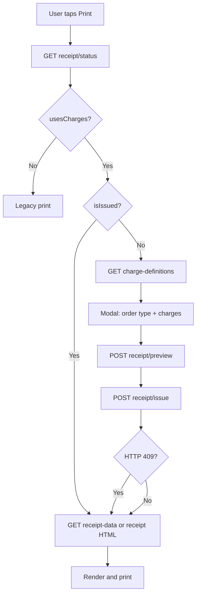
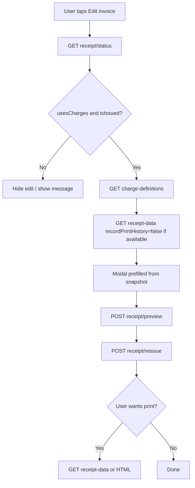

# Android Integration Guide — Receipt Charge System

**Audience:** Android developer  
**API:** V2 UserApi (same JWT as existing app)  
**Base path:** `/api/v2.0/UserApi`

This is the **final** integration contract. Match web behavior where noted; do not invent client-side totals.

---

## 1. Overview (read this first)

Configurable charges (service, VAT, packaging, delivery, …) on receipts.

| Rule | Detail |
|------|--------|
| Feature flag | Per restaurant (`ReceiptChargesEnabled`). Off by default. Admin enables it. |
| Order creation | **No changes** to `createOrder` / order item payloads. Do **not** send charges when creating an order. |
| Auto-issue on settlement | When order status becomes **8 (پرداخت شده)** or **11 (بسته شده)**, the **server** auto-issues a snapshot using restaurant default charges for that order’s `OrderType`. No print required. Skipped if a snapshot already exists or the feature is off. |
| Print | Optional. Uses the saved snapshot when issued. |
| First Issue (manual) | If not yet issued: user picks order type + charges → Preview → **Issue** → print. |
| Edit after lock | `POST .../receipt/reissue` replaces the snapshot. Print optional after save. |
| Reprint | Snapshot only. **Never call Issue again** for reprint. |
| Legacy | Feature off → keep today’s print path unchanged. |

**Important for Android:** After mark-as-paid / close, `isIssued` is often already `true` even if the user never opened the charge modal. Print must go straight to snapshot; editing must use **Reissue**, not Issue.

---

## 2. Auth & Base URL

```
Authorization: Bearer <jwt>
Content-Type: application/json
```

Example:

```
https://your-domain.com/api/v2.0/UserApi/orders/3120/receipt/status
```

Same login/refresh as other V2 endpoints. See [MOBILE_AUTH_MIGRATION.md](./MOBILE_AUTH_MIGRATION.md).

---

## 3. Feature detection (`receipt/status`)

Call this **before** print or edit:

```
GET /api/v2.0/UserApi/orders/{orderId}/receipt/status
```

**Response:**

```json
{
  "success": true,
  "message": null,
  "data": {
    "orderId": 3120,
    "isIssued": false,
    "issuedAt": null,
    "usesCharges": true
  }
}
```

| Condition | Android action |
|-----------|----------------|
| `usesCharges == false` | **Legacy print** (existing code). No charge UI. |
| `usesCharges == true` && `isIssued == false` | Show charge modal → Preview → **Issue** → print. |
| `usesCharges == true` && `isIssued == true` | **Print:** skip modal → `receipt-data` or HTML. **Edit charges:** open modal in edit mode → Preview → **Reissue**. |

`usesCharges` mirrors the restaurant flag. It does **not** mean “this order was created after the feature was turned on.” Auto-issue still runs when the flag is on; older orders may get a snapshot with charges disabled by server defaults.

---

## 4. Flows

### 4.1 Print



### 4.2 Edit charges (after issued)



Note: V2 `receipt-data` always records print history today. For edit-prefill you can still call it, or rebuild the modal from definitions + last known totals. Prefer loading snapshot via `receipt-data` once, then only print when the user confirms.

---

## 5. API Endpoints

### 5.1 Charge templates (modal)

```
GET /api/v2.0/UserApi/restaurants/{restaurantId}/charge-definitions
```

Returns `[]` if feature is off.

```json
{
  "success": true,
  "data": [
    {
      "id": 1,
      "code": "service",
      "title": "حق سرویس",
      "chargeCategory": 1,
      "calculationType": 0,
      "value": 10,
      "isEnabled": false,
      "isTaxable": true,
      "percentageBase": 0,
      "displayOrder": 10,
      "appliesToOrderTypes": 7
    }
  ]
}
```

**Default templates (server may create these):** `service`, `vat`, `packaging`, `delivery`.

Filter list with bitmask `appliesToOrderTypes` for selected order type:

| Flag | Value |
|------|-------|
| DineIn | 1 |
| Takeaway | 2 |
| Delivery | 4 |
| All | 7 |

Rule: `((appliesToOrderTypes & flagFor(orderType)) != 0)`.

### 5.2 Preview (live calc, no save)

```
POST /api/v2.0/UserApi/orders/{orderId}/receipt/preview
```

**Body:**

```json
{
  "orderType": 0,
  "charges": [
    {
      "definitionId": 1,
      "code": "service",
      "isEnabled": true,
      "value": 10
    },
    {
      "definitionId": 2,
      "code": "vat",
      "isEnabled": true,
      "value": 9
    }
  ]
}
```

**Response:** full `ReceiptDto` in `data`.

Call again whenever order type or any charge toggle/value changes.  
Preview is allowed **even after** a snapshot exists (for edit UI).

### 5.3 Issue (first lock only)

```
POST /api/v2.0/UserApi/orders/{orderId}/receipt/issue
```

Same body as Preview.

**Success (200):** `data` is a **full** `ReceiptDto` (`isIssued: true`, totals, `chargeLines`, items, …). You may print from this payload or call `receipt-data` / HTML.

**Already issued (409):**

```json
{
  "success": false,
  "message": "فاکتور این سفارش قبلاً صادر شده است. برای چاپ مجدد از همان فاکتور استفاده کنید."
}
```

On **409:** do **not** show a hard error. Treat as reprint → `GET receipt-data` or HTML.

### 5.4 Reissue (replace snapshot after lock)

```
POST /api/v2.0/UserApi/orders/{orderId}/receipt/reissue
```

Same body as Preview.

- Replaces the existing snapshot.
- Does **not** require print.
- **404** if no snapshot yet (call Issue instead).
- **Success (200):** full `ReceiptDto`.

Use for “ویرایش فاکتور” after auto-issue or a prior Issue.

### 5.5 Receipt JSON (native thermal print)

```
GET /api/v2.0/UserApi/orders/{orderId}/receipt-data
```

| Case | Result |
|------|--------|
| Feature on + issued | Saved snapshot JSON |
| Feature on + not issued | `404` — فاکتور هنوز صادر نشده |
| Feature off | Legacy receipt JSON |

### 5.6 Receipt HTML (WebView print)

```
GET /api/v2.0/UserApi/orders/{orderId}/receipt
```

Returns `text/html; charset=utf-8`.

| Case | Result |
|------|--------|
| Feature on + not issued | `400` |
| Feature on + issued | HTML from snapshot |
| Feature off | Legacy HTML |

### 5.7 Save charge templates (optional)

```
POST /api/v2.0/UserApi/restaurants/{restaurantId}/charge-definitions
```

```json
{ "definitions": [ /* ChargeDefinitionDto list */ ] }
```

Optional on Android; web panel can configure templates. Add only if you build a settings screen.

---

## 6. Kotlin models

Enums are serialized as **integers** (not strings).

```kotlin
enum class OrderType(val value: Int) {
    DINE_IN(0), TAKEAWAY(1), DELIVERY(2)
}

enum class ChargeCategory(val value: Int) {
    DISCOUNT(0), FEE(1), TAX(2)
}

enum class CalculationType(val value: Int) {
    PERCENTAGE(0), FIXED(1)
}

// appliesToOrderTypes: DineIn=1, Takeaway=2, Delivery=4, All=7
```

```kotlin
data class ApiResponse<T>(
    val success: Boolean,
    val message: String?,
    val data: T?
)

data class ReceiptStatusDto(
    val orderId: Int,
    val isIssued: Boolean,
    val issuedAt: String?,
    val usesCharges: Boolean
)

data class ReceiptDto(
    val orderId: Int,
    val restaurantId: Int,
    val restaurantName: String,
    val orderNumber: String,
    val tableNumber: String,
    val orderStatus: String,
    val orderType: Int,
    val orderTypeLabel: String,
    val createdAt: String,
    val updatedAt: String?,
    val description: String?,
    val customerName: String?,
    val customerMobile: String?,
    val items: List<ReceiptItemDto>,
    val chargeLines: List<ReceiptChargeLineDto>,
    val itemsSubtotal: Double,
    val discountTotal: Double,
    val feesTotal: Double,
    val taxTotal: Double,
    val grandTotal: Double,
    val isIssued: Boolean,
    val issuedAt: String?,
    val usesCharges: Boolean
)

data class ReceiptItemDto(
    val name: String,
    val quantity: Int,
    val unitPrice: Double,
    val lineTotal: Double
)

data class ReceiptChargeLineDto(
    val definitionId: Int?,
    val code: String,
    val title: String,
    val category: Int,
    val calculationType: Int,
    val value: Double,
    val calculatedAmount: Double,
    val isTaxable: Boolean,
    val displayOrder: Int
)

data class ReceiptPreviewRequest(
    val orderType: Int = 0,
    val charges: List<ChargeSelection>
)

data class ChargeSelection(
    val definitionId: Int?,
    val code: String?,
    val isEnabled: Boolean,
    val value: Double?
)

data class ChargeDefinitionDto(
    val id: Int,
    val code: String,
    val title: String,
    val chargeCategory: Int,
    val calculationType: Int,
    val value: Double,
    val isEnabled: Boolean,
    val isTaxable: Boolean,
    val percentageBase: Int,
    val displayOrder: Int,
    val appliesToOrderTypes: Int
)
```

---

## 7. UI requirements

### Print button

1. `GET receipt/status`
2. Branch per section 3 / flowchart 4.1

### Charge modal — first Issue (`isIssued == false`)

- Order type: حضوری / بیرون‌بر / ارسال → `0 / 1 / 2`
- Charge rows from `charge-definitions`, filtered by `appliesToOrderTypes`
- Checkbox = `isEnabled`
- Value field: `%` if `calculationType == 0`, تومان if `calculationType == 1`
- Live totals from `POST receipt/preview`
- Primary CTA: **صدور و چاپ** → `POST receipt/issue` → print

### Already issued

- **چاپ:** no modal; `receipt-data` or HTML
- **ویرایش فاکتور** (recommended, matches web):
  - Prefill order type + charges from snapshot `chargeLines` (enabled lines that appear on receipt; missing applicable defs → unchecked)
  - Preview → **Reissue**
  - Optional: “ذخیره” (reissue, no print) and “ذخیره و چاپ”

### Display only — never recalculate on device

Server order:

```
ItemsNet → Discounts → Fees → TaxableBase → Taxes → GrandTotal
```

| Field | Label |
|-------|-------|
| `itemsSubtotal` | جمع اقلام |
| `discountTotal` | تخفیف |
| `feesTotal` | کارمزدها |
| `taxTotal` | مالیات |
| `grandTotal` | مبلغ قابل پرداخت |

Use `chargeLines[]` for line detail (`title`, `calculatedAmount`, `category`).

---

## 8. Error handling

| HTTP | When | Android action |
|------|------|----------------|
| `200` | OK | Continue |
| `400` | Feature off / not issued (HTML) / validation | Show `message` |
| `401` | Bad/expired JWT | Refresh / re-login |
| `403` | Order not owned by this owner | Access error |
| `404` | Order missing, or Issue/Reissue/receipt-data when snapshot state wrong | Show `message` |
| `409` | Issue but snapshot already exists | **Reprint fallback** (not a user-facing failure) |

---

## 9. What NOT to change

- `createOrder` and order-list APIs
- Do not attach charges to order creation
- Do not call **Issue** on reprint
- Do not call **Issue** when `isIssued == true` (use **Reissue** to change amounts)
- Do not recompute money on the client
- Status updates to 8/11 already trigger server auto-issue; Android does not need a separate “issue on settle” call

---

## 10. Suggested Retrofit API

Assume Retrofit `baseUrl` already ends with `/api/v2.0/UserApi/`.

```kotlin
interface ReceiptApi {
    @GET("orders/{orderId}/receipt/status")
    suspend fun getStatus(@Path("orderId") orderId: Int): Response<ApiResponse<ReceiptStatusDto>>

    @GET("restaurants/{restaurantId}/charge-definitions")
    suspend fun getChargeDefinitions(
        @Path("restaurantId") restaurantId: Int
    ): Response<ApiResponse<List<ChargeDefinitionDto>>>

    @POST("orders/{orderId}/receipt/preview")
    suspend fun preview(
        @Path("orderId") orderId: Int,
        @Body body: ReceiptPreviewRequest
    ): Response<ApiResponse<ReceiptDto>>

    @POST("orders/{orderId}/receipt/issue")
    suspend fun issue(
        @Path("orderId") orderId: Int,
        @Body body: ReceiptPreviewRequest
    ): Response<ApiResponse<ReceiptDto>>

    @POST("orders/{orderId}/receipt/reissue")
    suspend fun reissue(
        @Path("orderId") orderId: Int,
        @Body body: ReceiptPreviewRequest
    ): Response<ApiResponse<ReceiptDto>>

    @GET("orders/{orderId}/receipt-data")
    suspend fun getReceiptData(@Path("orderId") orderId: Int): Response<ApiResponse<ReceiptDto>>

    @GET("orders/{orderId}/receipt")
    suspend fun getReceiptHtml(@Path("orderId") orderId: Int): Response<ResponseBody>
}
```

**Issue + 409 fallback:**

```kotlin
suspend fun issueOrLoadSnapshot(orderId: Int, body: ReceiptPreviewRequest): ReceiptDto {
    val response = receiptApi.issue(orderId, body)
    if (response.code() == 409) {
        val reprint = receiptApi.getReceiptData(orderId)
        if (!reprint.isSuccessful) error(reprint.message())
        return reprint.body()!!.data!!
    }
    if (!response.isSuccessful) error(response.message())
    return response.body()!!.data!!
}
```

---

## 11. Testing checklist

1. Feature **off** → legacy print unchanged.
2. Feature **on**, order **not** issued → modal on first print; Issue + print works.
3. Preview totals change when toggling charges / order type.
4. Settle order to status **8** or **11** without printing → `status.isIssued == true`.
5. Print after settle → no modal; same totals as auto-issued snapshot.
6. Second print → no Issue call; same totals.
7. Issue while already issued → **409** → app still prints snapshot.
8. Edit (Reissue) changes charges → new `grandTotal`; optional print.
9. Reissue when not issued → **404**.
10. Wrong restaurant owner → **403**.
11. Expired token → **401** → refresh works.

---

## 12. QA / rollout

Admin must enable the restaurant:

**Admin panel → فاکتور با کارمزد → enable for test restaurant**

Until then, `usesCharges` stays `false` and the app behaves as today.

---

## 13. Backend reference (server team)

| File | Purpose |
|------|---------|
| `Controllers/Api/V2/UserApiController.Receipt.cs` | Endpoints |
| `Models/Receipt/ReceiptDto.cs` | DTOs |
| `Models/Receipt/ReceiptEnums.cs` | Enums |
| `Services/Receipt/ReceiptService.cs` | Issue / Reissue / Auto-issue / Status |
| `docs/MOBILE_AUTH_MIGRATION.md` | JWT |
